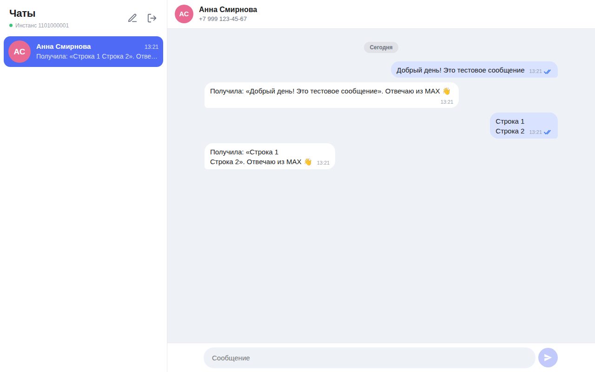

# MAX Chat — тестовое задание GREEN-API

Веб-интерфейс для отправки и получения текстовых сообщений в мессенджере **MAX** через [GREEN-API](https://green-api.com/max).
Внешний вид — по мотивам [web.max.ru](https://web.max.ru/).



## Что умеет

- Вход по данным инстанса GREEN-API: `idInstance`, `apiTokenInstance` (и `apiUrl`, подставляется автоматически). Перед входом проверяется, что инстанс авторизован ([`getStateInstance`](https://green-api.com/v3/docs/api/account/GetStateInstance/)).
- Новый чат по номеру телефона: номер проверяется методом [`CheckAccount`](https://green-api.com/v3/docs/api/service/CheckAccount/), который возвращает `chatId` пользователя MAX.
- Отправка текста методом [`SendMessage`](https://green-api.com/v3/docs/api/sending/SendMessage/).
- Получение сообщений по технологии [HTTP API](https://green-api.com/v3/docs/api/receiving/technology-http-api/): цикл [`ReceiveNotification`](https://green-api.com/v3/docs/api/receiving/technology-http-api/ReceiveNotification/) → обработка → [`DeleteNotification`](https://green-api.com/v3/docs/api/receiving/technology-http-api/DeleteNotification/).
- Статусы исходящих (отправлено / доставлено / прочитано), повтор отправки при ошибке.
- История чатов сохраняется в `localStorage` браузера, отдельно для каждого инстанса.
- Адаптивная вёрстка (на телефоне — один экран за раз), светлая и тёмная тема.

## Быстрый старт

Требуется Node.js 20.19+ или 22.12+ (требование Vite 8).

```bash
git clone <ссылка на репозиторий>
cd max-chat
npm install
npm run dev
```

Откройте http://localhost:5173 и войдите с данными инстанса из [личного кабинета GREEN-API](https://console.green-api.com).

### Перед первым запуском с реальным инстансом

1. Создайте инстанс MAX в личном кабинете и авторизуйте его (номер РФ или РБ).
2. Поле «URL для входящих уведомлений» (webhookUrl) должно быть **пустым** — иначе уведомления уходят на вебхук, а не в очередь HTTP API.
3. Включите «Получать уведомления о входящих сообщениях» и «…о статусах отправленных сообщений».

### Демо без аккаунта GREEN-API

Вместе с `npm run dev` автоматически запускается локальная заглушка API (`scripts/mock-green-api.js`, порт 4010), которая имитирует собеседника. Ничего дополнительно запускать не нужно.

Вход: `idInstance` = `1101000001`, `apiTokenInstance` = `demo` — `apiUrl` (`http://localhost:4010`) подставится сам.
Номер для нового чата — любой номер РФ; номер, оканчивающийся на `0000`, имитирует «нет аккаунта MAX».

## Сценарий проверки (из ТЗ)

1. Ввести `idInstance` и `apiTokenInstance` → «Войти».
2. Нажать ✎ → ввести номер получателя → «Создать».
3. Написать сообщение → Enter (Shift+Enter — перенос строки).
4. Ответить с телефона получателя в MAX.
5. Ответ появится в чате в течение нескольких секунд.

## Команды

| Команда | Что делает |
| --- | --- |
| `npm run dev` | Режим разработки |
| `npm run build` | Сборка в `dist/` |
| `npm run preview` | Просмотр собранной версии |
| `npm test` | Unit-тесты (Vitest) |
| `npm run lint` | Линтер (oxlint) |
| `npm run mock` | Заглушка GREEN-API отдельно (в `npm run dev` уже включена; отключить: `NO_MOCK=1 npm run dev`) |

## Структура

```
src/
  api/greenApi.js            клиент GREEN-API: 5 методов, понятные ошибки
  hooks/useNotifications.js  цикл получения уведомлений (long polling)
  hooks/useStoredState.js    useState + localStorage
  lib/notifications.js       разбор входящих уведомлений → события приложения
  lib/chats.js               чистые функции над списком чатов (дедупликация, статусы)
  lib/phone.js               нормализация и проверка номера
  components/                LoginScreen, Sidebar, ChatWindow, Messenger
scripts/mock-green-api.js    заглушка API для демо
tests/                       unit-тесты
```

## Решения

- **Без лишних зависимостей.** Только React и Vite: задача небольшая, а `fetch` хватает для пяти методов API.
- **Логика отделена от интерфейса.** Работа с уведомлениями и чатами — чистые функции в `lib/`, их легко тестировать.
- **Надёжное получение.** Уведомление удаляется из очереди в `finally`, даже если его не удалось разобрать, — очередь не «застревает». При сетевой ошибке цикл ждёт 3 секунды и продолжает; при выходе или смене инстанса останавливается через `AbortController`.
- **Без дублей.** Уведомление о собственном отправленном сообщении может прийти раньше ответа `sendMessage` — оно склеивается с уже показанным сообщением.
- **Безопасность.** Токен хранится только в браузере пользователя и отправляется напрямую в GREEN-API. Кнопка «Выйти» удаляет его.

## Деплой

Проект собирается в статику (`npm run build` → `dist/`) и публикуется на Vercel, Netlify или GitHub Pages без дополнительных настроек: Framework preset — Vite, команда сборки `npm run build`, папка `dist`.
